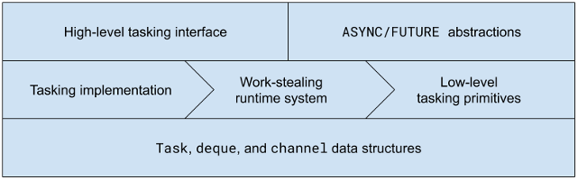

# Tasking 2.0

An evolution of the task-parallel runtime system/library developed in my
[thesis][1]

Related: Check out [Weave][2], a [multithreading runtime][3] for the [Nim
programming language][4].

## Build
On x86-64 GNU/Linux:
```console
$ make CC=gcc
(...)
```

## Test
```console
$ utils/testrun.py -d
build/spc 10000 1: ..........
build/bpc 10000 9 1: ..........
build/bpc 10000 9 10 1: ..........
build/fib-like 30 1: ..........
```

## Benchmark
```console
$ NUM_THREADS=4 utils/benchmark.py -s build/fib-like 30 1
NUM_THREADS=4 build/fib-like 30 1: ..........
+--------+--------+--------+--------+--------+--------+--------+---------+---------+---------+-----------------+
|  Min   |  P10   |  P25   | Median |  P75   |  P90   |  Max   | P75-P25 | P90-P10 | Max-Min |   Mean ± RSD    |
+--------+--------+--------+--------+--------+--------+--------+---------+---------+---------+-----------------+
| 343.05 | 343.41 | 343.57 | 344.23 | 345.12 | 345.81 | 348.38 |  1.55   |   2.4   |  5.33   | 344.58 ± 0.45 % |
+--------+--------+--------+--------+--------+--------+--------+---------+---------+---------+-----------------+
```

## High-level Overview


<!-- References -->

[1]: https://epub.uni-bayreuth.de/2990
[2]: https://github.com/mratsim/weave
[3]: https://github.com/nim-lang/RFCs/issues/160
[4]: https://nim-lang.org
